<div align="center">

# 💰 Expenses Tracker — End-to-End DevOps Pipeline

### A Spring Boot expense-tracking app, containerized, orchestrated, and shipped through a dual CI/CD pipeline to Kubernetes on AWS EC2.

[](https://openjdk.org/)
[](https://spring.io/projects/spring-boot)
[](https://www.docker.com/)
[](https://kubernetes.io/)
[](https://www.jenkins.io/)
[](https://github.com/features/actions)
[](https://www.mysql.com/)
[](https://aws.amazon.com/ec2/)

</div>

---

## 📚 Table of Contents

- [Overview](#-overview)
- [Architecture](#️-architecture)
- [Tech Stack](#-tech-stack)
- [Project Structure](#-project-structure)
- [Step-by-Step Deployment](#-step-by-step-how-this-project-was-deployed)
- [Challenges I Ran Into](#-challenges-i-ran-into-and-how-i-solved-them)
- [Screenshots](#-screenshots)
- [Key Takeaways](#-key-takeaways)
- [License](#-license)

---

## 📖 Overview

**Expenses Tracker** is a Spring Boot MVC web application (Thymeleaf + Spring Security + Spring Data JPA + MySQL) that lets users sign up, log in, and track their personal expenses by category.

This repository is my hands-on DevOps rebuild of the project — I forked/cloned the base application and layered a full production-style delivery pipeline on top of it:

- 🐳 **Containerized** the app with a multi-stage `Dockerfile` and orchestrated local runs with `docker compose`.
- ☸️ **Deployed to Kubernetes** using Deployments, a StatefulSet for MySQL, Services, an NGINX Ingress, and Secrets.
- 🔁 **Automated CI/CD** with **two parallel pipelines** — a `Jenkinsfile` and a GitHub Actions workflow — that build, test, push, and deploy on every change.
- ☁️ **Deployed onto a self-managed Kubernetes cluster running on an AWS EC2 instance**, with Jenkins pushing manifests and rolling out updates over SSH.

---

## 🏗️ Architecture

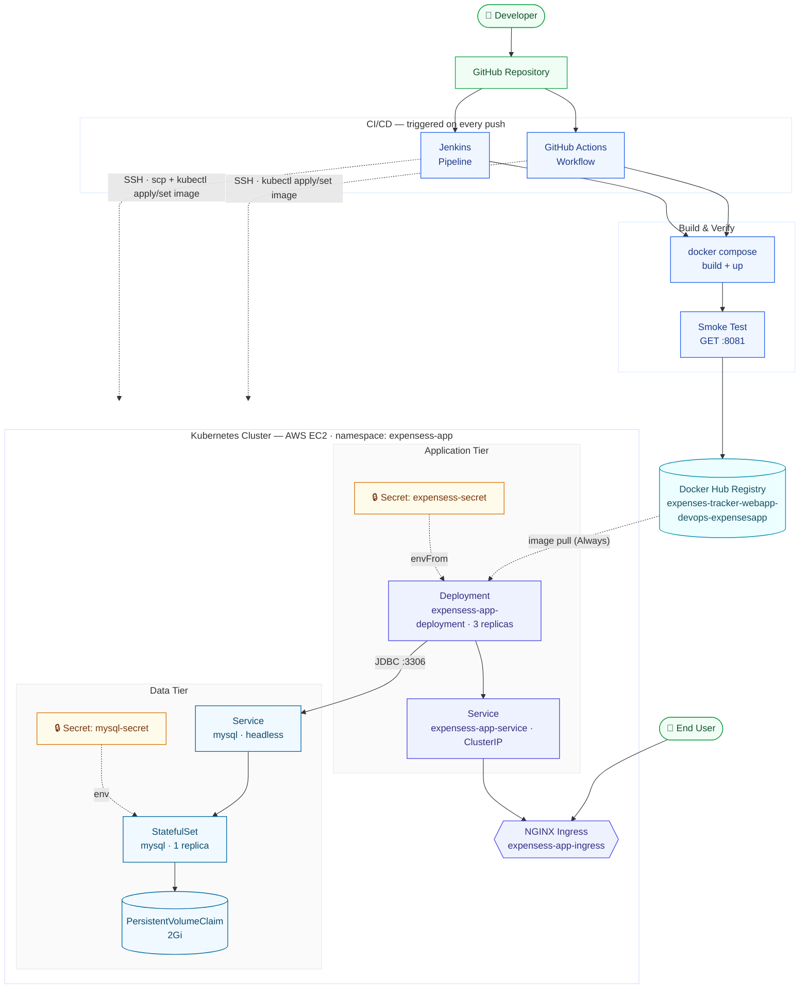

**Legend:** 🟩 Entry / exit points  ·  🟦 CI/CD, build &amp; registry  ·  🟪 Kubernetes control objects  ·  🔷 MySQL data tier  ·  🟧 Kubernetes Secrets

**Flow in plain words:** a push to GitHub triggers **both** Jenkins and GitHub Actions independently → each builds and smoke-tests the stack with `docker compose`, then pushes the app image to Docker Hub → each pipeline also `ssh`es into the EC2-hosted Kubernetes cluster to `kubectl apply` the manifests and `kubectl set image` the Deployment to the freshly pushed tag → the app pods (injected with `expensess-secret`) talk to MySQL over the headless `mysql` Service on port `3306`, and MySQL itself reads its credentials from the separate `mysql-secret` → external traffic reaches the app through the NGINX Ingress → `expensess-app-service` → the Deployment's pods.

---

## 🧰 Tech Stack

| Layer | Technology |
|---|---|
| **Application** | Java 17, Spring Boot 3.2.2, Spring MVC, Spring Security, Spring Data JPA, Thymeleaf |
| **Database** | MySQL 8 (latest) |
| **Containerization** | Docker (multi-stage build), Docker Compose |
| **Orchestration** | Kubernetes (Deployment, StatefulSet, Service, Ingress, Secret, Namespace) |
| **Ingress Controller** | NGINX Ingress |
| **CI/CD** | Jenkins (declarative pipeline), GitHub Actions |
| **Registry** | Docker Hub |
| **Cloud / Hosting** | AWS EC2 (self-managed Kubernetes node) |

---

## 📁 Project Structure

```
Expenses-Tracker-WebApp-DevOps/
├── Dockerfile                  # Multi-stage build: Maven build → JRE runtime
├── compose.yaml                # Local orchestration: app + MySQL
├── Jenkinsfile                 # Declarative CI/CD pipeline
├── sql_script.sql              # DB schema (categories, clients, expenses, users, roles)
├── k8s/
│   ├── namespace.yaml          # expensess-app namespace
│   ├── ingress.yaml            # NGINX ingress routing "/"
│   ├── expensesapp/
│   │   ├── deployment.yaml     # 3-replica app Deployment
│   │   ├── service.yaml        # ClusterIP service, port 80 → 8080
│   │   └── secret.yaml         # DB connection secrets (base64)
│   └── mysql/
│       ├── statefulset.yaml    # MySQL StatefulSet + PVC (2Gi)
│       ├── service.yaml        # Headless service for MySQL
│       └── mysql-secret.yaml   # Root password + DB name (base64)
├── outputs/                    # Deployment proof screenshots (Jenkins + GitHub Actions runs)
└── src/                        # Spring Boot MVC source code
```

---

## 🚀 Step-by-Step: How This Project Was Deployed

### 1️⃣ Local Containerization

```bash
git clone https://github.com/Mridul-Hassan-07/Expenses-Tracker-WebApp-DevOps.git
cd Expenses-Tracker-WebApp-DevOps
```

- Wrote a **multi-stage `Dockerfile`**: stage 1 uses `maven:3.9.6-eclipse-temurin-17` to build the JAR (`mvn clean package -DskipTests`), stage 2 copies just the built JAR into a lightweight `eclipse-temurin:17-jre-alpine` runtime image.
- Wrote `compose.yaml` to spin up the app alongside a MySQL container on a shared `two_tier` bridge network, with a named volume (`mysql-data`) for persistence and a `mysqladmin ping` healthcheck so the app only starts once MySQL is actually ready.

```bash
docker compose up -d --build
```

The app comes up on **`localhost:8081`**, MySQL is exposed on host port **`3307`** (mapped to container `3306`, to avoid clashing with any local MySQL install).

### 2️⃣ Kubernetes Manifests

- Created a dedicated **`expensess-app`** namespace to isolate all resources.
- **MySQL** runs as a `StatefulSet` (stable identity + a `PersistentVolumeClaim` for durable storage) behind a **headless service** (`clusterIP: None`), since a database needs a stable network identity more than load-balancing. Its root password and database name come from the **`mysql-secret`**, injected key-by-key via `valueFrom.secretKeyRef`.
- **The app** runs as a `Deployment` with **3 replicas** behind a regular `ClusterIP` `Service`, fronted by an **NGINX Ingress** so it's reachable from outside the cluster. Its datasource URL/username/password come from a separate **`expensess-secret`**, injected all at once via `envFrom.secretRef`.
- Both secrets store their values **base64-encoded** and neither is committed with real production credentials — nothing sensitive is hardcoded directly into the manifests.

### 3️⃣ CI/CD — Jenkins Pipeline

The `Jenkinsfile` defines a declarative pipeline with these stages:

| Stage | What it does |
|---|---|
| **Checkout** | Pulls the latest code from GitHub |
| **Build & Start** | Injects credentials via `withCredentials`, runs `docker compose up -d --build` |
| **Test** | Waits for the stack to settle, then `curl`s `localhost:8081` as a basic smoke test |
| **Docker Hub Login** | Authenticates using stored Jenkins credentials |
| **Push Images** | `docker compose push` — publishes the built image to Docker Hub |
| **Deploy to Kubernetes (EC2)** | `scp`s the `k8s/` manifests to the EC2 host over SSH, then remotely runs `kubectl apply -f k8s/ -R` and `kubectl set image` to roll the Deployment to the newly pushed image, followed by `kubectl rollout status` to confirm success |
| **Post: always** | Tears down the local `docker compose` stack (`docker compose down -v`) to keep the Jenkins agent clean |

All secrets (Docker Hub creds, MySQL password, DB name, datasource URL/username/password, and the EC2 SSH key) are stored as **Jenkins credentials** and never appear in plain text in the pipeline.

### 4️⃣ CI/CD — GitHub Actions (parallel pipeline)

A mirrored GitHub Actions workflow performs the same build → test → push cycle *and* the same SSH-based deployment to the EC2 Kubernetes cluster, triggered directly on `git push` — a second, Jenkins-independent path that can build, verify, and ship changes on its own without needing the Jenkins server to be up.

### 5️⃣ Production Deployment on AWS EC2

- An EC2 instance runs a self-managed Kubernetes cluster (`kubectl` accessible via SSH).
- Jenkins connects to it with an SSH credential, copies over the manifests, and applies them:

```bash
kubectl apply -f k8s/namespace.yaml
kubectl apply -f k8s/ -R
kubectl set image deployment/expensess-app-deployment \
  expensess-app=<dockerhub-user>/expenses-tracker-webapp-devops-expensesapp:latest \
  --namespace=expensess-app
kubectl rollout status deployment/expensess-app-deployment --namespace=expensess-app --timeout=180s
```

- Once rolled out, the app is reachable through the NGINX Ingress on the EC2 instance's public IP.

---

## 🐛 Challenges I Ran Into (and How I Solved Them)

- **MySQL not ready when the app started up** — `docker compose`'s `depends_on` only waits for the container to *start*, not for MySQL to actually be ready to accept connections. Added a proper `healthcheck` (`mysqladmin ping`) with retries and a `start_period`, and a `sleep 60` buffer in the Jenkins "Test" stage before hitting the app's health endpoint.
- **Port collisions on the host** — MySQL's default `3306` was already taken locally, so I remapped the container to host port `3307` in `compose.yaml` to avoid clashing with an existing local MySQL install.
- **Secrets sprawl across environments** — the same credentials needed to exist in three different forms: `.env`/Jenkins credentials for Compose, base64-encoded values for Kubernetes `Secret`s, and Jenkins credential bindings for the pipeline itself. Keeping these in sync (and never committing plaintext) took care — I centralized everything through Jenkins' `withCredentials` and Kubernetes `Secret` objects instead of hardcoding anything in manifests.
- **Namespace/name consistency across manifests** — Kubernetes is unforgiving about mismatched `namespace` and `selector` labels across `Deployment`/`Service`/`Secret` files; a single typo silently breaks service discovery (pods running, but the Service finds nothing). Standardizing the namespace and label names across every manifest fixed a string of confusing "it's running but not reachable" issues.
- **Remote deployment over SSH from Jenkins** — running a multi-line remote script via `ssh ... << 'EOF' ... EOF` inside a Jenkins `sh` step is finicky with quoting and variable expansion (especially passing `DOCKERHUB_USERNAME` into the remote shell). Had to be explicit about which variables should expand locally vs. remotely.
- **Image tag drift** — the image name/tag referenced in `compose.yaml`, the `Jenkinsfile`, and `k8s/expensesapp/deployment.yaml` all had to match exactly, or the Deployment would either pull a stale image or hit `ImagePullBackOff`. Standardized on one image name pattern and referenced it consistently everywhere.
- **Rollout timeouts on a resource-constrained EC2 instance** — with 3 replicas and limited EC2 capacity, rollouts occasionally needed more than the default timeout; tuned `kubectl rollout status --timeout` to a realistic value rather than letting the pipeline fail on slow-but-successful rollouts.

---

## 📸 Screenshots

Deployment evidence for both pipelines, captured straight from Jenkins/GitHub Actions runs and the EC2-hosted cluster.

### 🔧 Jenkins Pipeline → EC2

<p align="center">
  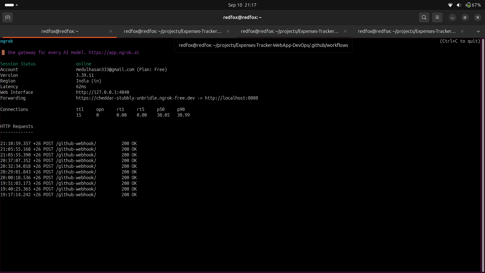
  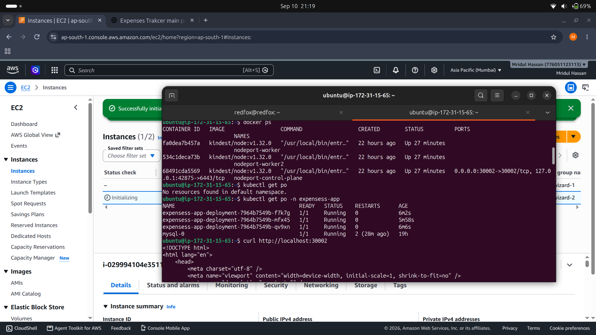
</p>
<p align="center">
  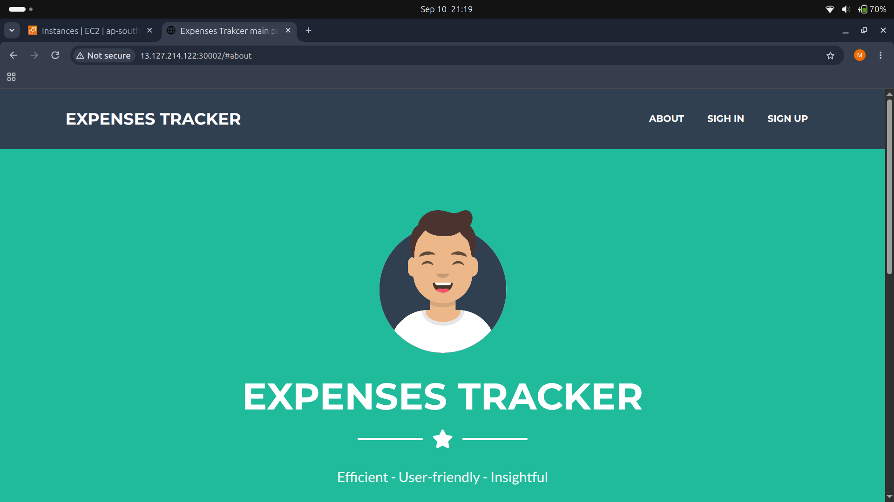
  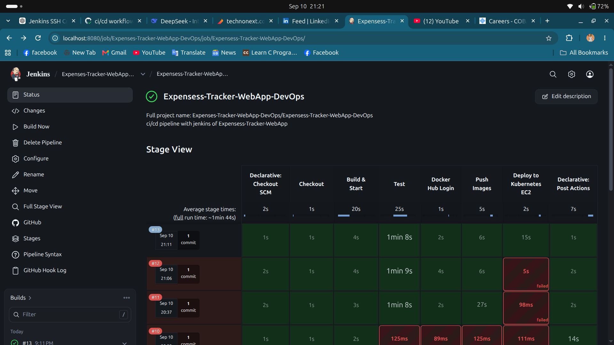
</p>

### ⚡ GitHub Actions Pipeline → EC2

<p align="center">
  
  
  
</p>
<p align="center">
  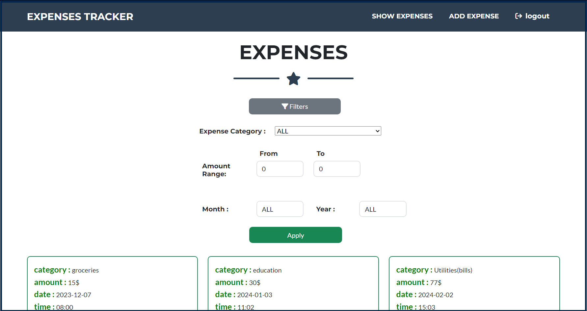
  
  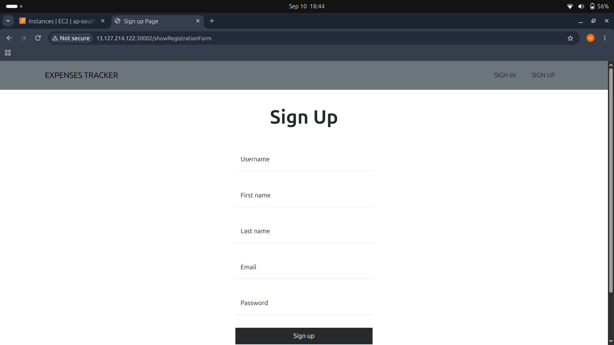
</p>
<p align="center">
  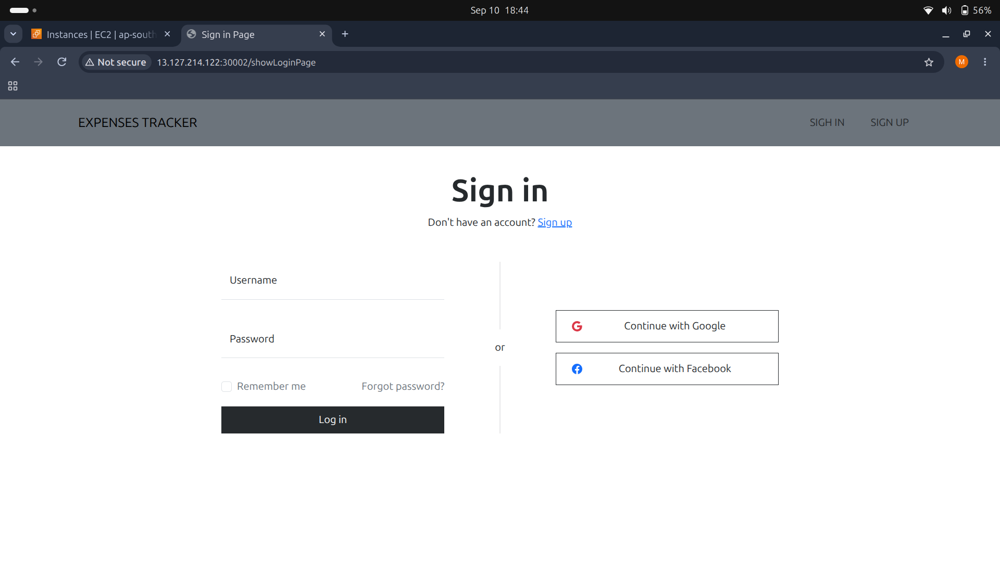
  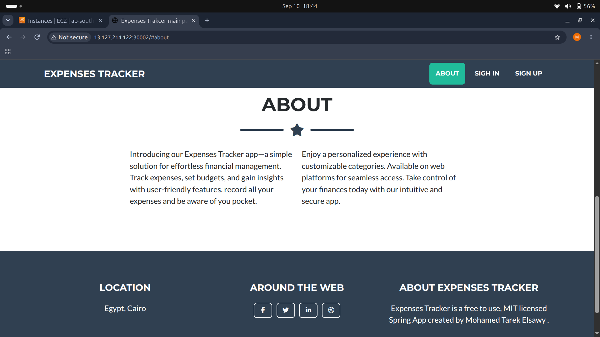
  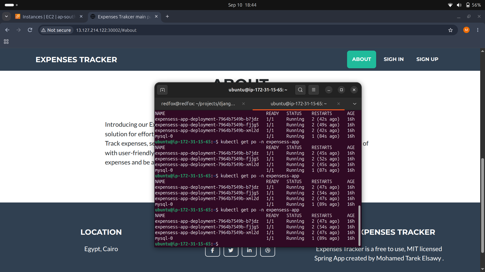
</p>
<p align="center">
  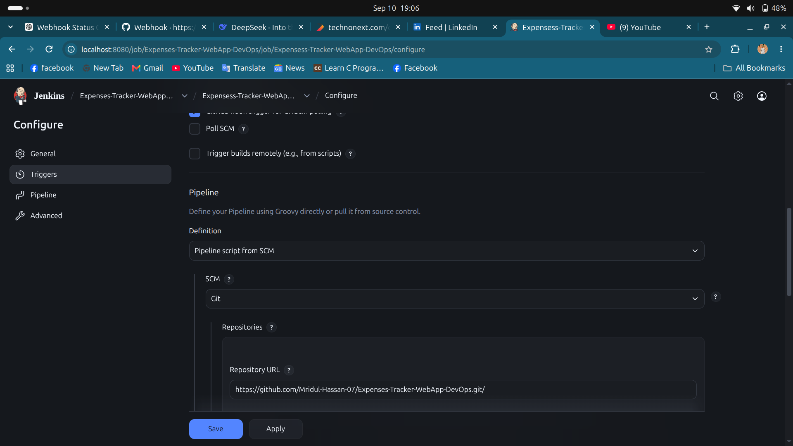
  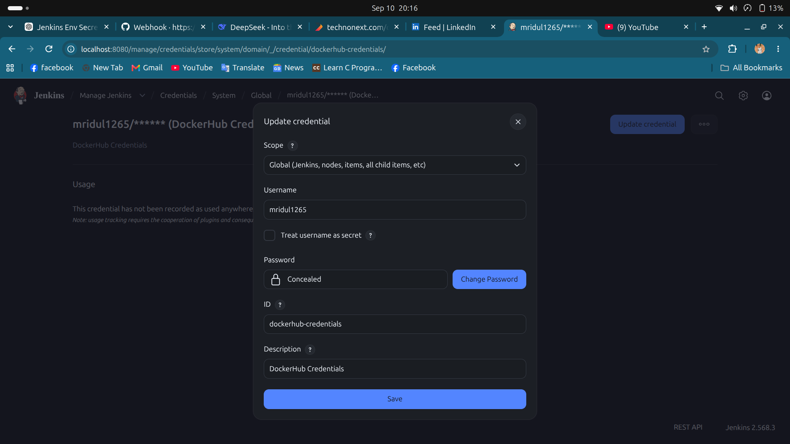
  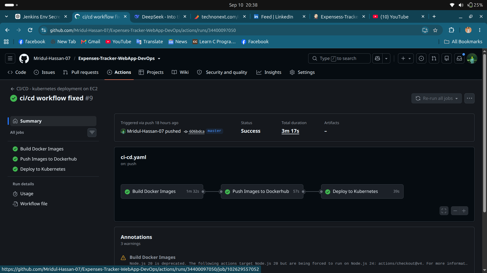
</p>

> 📁 Full-resolution originals live in [`outputs/`](./outputs) if you want to open any of them individually.

---

## 📌 Key Takeaways

This project was less about the Spring Boot app itself and more about practicing **the full delivery lifecycle** — going from source code to a running, self-healing, horizontally-scaled service on real infrastructure, with two independent automation paths (Jenkins + GitHub Actions) proving the pipeline isn't dependent on a single tool.

---

## 📄 License

This project is licensed under the [MIT License](./LICENSE).
